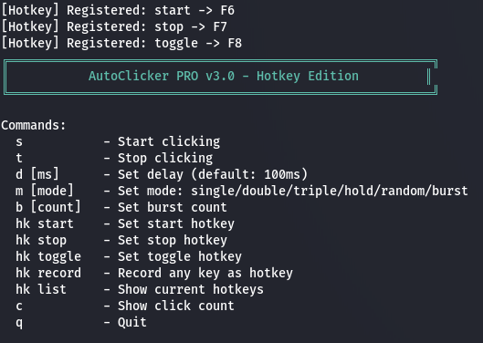
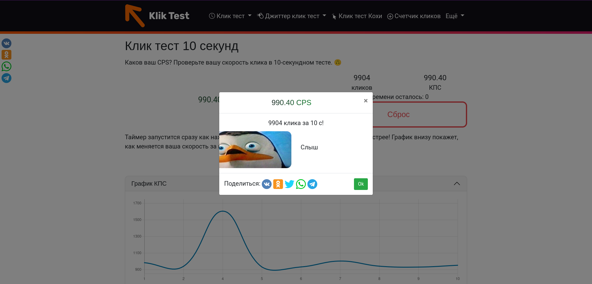

# AutoClicker PRO v3.0

[](https://github.com/Alex767-star/AutoClicker/actions)
[](https://github.com/Alex767-star/AutoClicker/releases/latest)
[](https://github.com/Alex767-star/AutoClicker/releases)
[](LICENSE)

**Professional cross-platform click automation tool with human-like behavior**

## 📸 Screenshots

| Linux Main | Windows Main | Settings |
|------------|--------------|----------|
|  |  |  |

## ✨ Features

### 🎯 7 Click Modes
- **Single** - Regular single click
- **Double** - Double click with 50ms interval
- **Triple** - Triple click for gaming
- **Hold** - Continuous hold (release on stop)
- **Random** - Random delay between clicks
- **Burst** - Fixed number of rapid clicks
- **Human** - Gaussian delay distribution + cursor jitter

### 🖱️ Target Types (Linux)
- **Current Position** - Click where cursor is
- **Saved Position** - Click at stored coordinates (F9)
- **Moving Target** - Random offset from cursor

### ⌨️ Hotkeys
- **F6** - Start clicking
- **F7** - Stop clicking
- **F8** - Toggle clicking
- **F9** - Save current position (Linux)
- **ESC** - Exit

### ⚙️ Human-like Parameters
- **Delay**: 1-1000ms (default: 15ms = 67 CPS)
- **Variance**: ±ms randomness (default: ±5ms)
- **Jitter**: cursor movement in pixels (default: 3px)

## 🚀 Installation

### Linux

```bash
# Download binary
wget https://github.com/Alex767-star/AutoClicker/releases/latest/download/autoclicker-linux-x86_64
chmod +x autoclicker-linux-x86_64
sudo mv autoclicker-linux-x86_64 /usr/local/bin/autoclicker

# Run
autoclicker
```
Windows

Option 1: Download EXE
cmd

Download autoclicker.exe from Releases
Run as Administrator (required for input simulation)

Option 2: Build with MinGW
cmd

cd windows
mingw32-make -f Makefile.mingw
autoclicker.exe

Option 3: Build with Visual Studio
cmd

Open windows/AutoClicker.sln in VS2022
Build -> Build Solution (Release x64)
Run autoclicker.exe as Administrator

📖 Usage
Commands
Command	Description
s	Start clicking
t	Stop clicking
d 15	Set base delay to 15ms
m 7	Set mode to Human
b 10	Set burst count to 10
v 5	Set variance to ±5ms
j 3	Set cursor jitter to 3px
c	Show click count
r	Reset counter
q	Quit
Human Mode Example
bash

# Optimal for anti-detection
d 15      # Base delay 15ms
v 5       # Randomness ±5ms (range 10-20ms)
j 3       # Cursor jitter 3px
m 7       # Human mode
s         # Start

🔧 Building from Source
Linux
```bash

git clone https://github.com/Alex767-star/AutoClicker.git
cd AutoClicker
mkdir build && cd build
cmake .. && make -j$(nproc)
./autoclicker
```
Windows (MinGW)
```bash

git clone https://github.com/Alex767-star/AutoClicker.git
cd AutoClicker/windows
x86_64-w64-mingw32-g++ -static -O2 -std=c++17 -pthread autoclicker_win.cpp -o autoclicker.exe -luser32 -lgdi32 -lwinmm
autoclicker.exe
```
📊 Performance
Mode	Typical CPS	CPU Usage
Single	1000 (1ms)	~5%
Human	50-100	~2%
Burst	20 CPS	~3%
⚠️ Windows Requirements

    Run as Administrator - Required for mouse_event API

    Windows 7/8/10/11

    Visual C++ Redistributable (if using pre-built EXE)

📁 Project Structure
text

AutoClicker/
├── src/                    # Linux source (C++17)
├── windows/                # Windows source
│   ├── autoclicker_win.cpp # Main Windows code
│   ├── build.bat          # VS build script
│   ├── build_mingw.bat    # MinGW build script
│   ├── AutoClicker.sln    # VS solution
│   └── AutoClicker.vcxproj # VS project
├── docs/screenshots/       # Documentation images
├── CMakeLists.txt         # Linux build
└── README.md              # This file

📝 Changelog
v3.0.0 (2024)

    Windows support added!

    Human-like mode with Gaussian delay distribution

    Cursor jitter for natural movement

    Configurable variance and jitter

    Cross-platform codebase (Linux + Windows)

    Pre-built binaries for both platforms

🤝 Contributing

    Fork repository

    Create feature branch

    Commit changes

    Push to branch

    Open Pull Request

⚠️ Disclaimer

For educational and automation purposes only. Use responsibly.
📄 License

MIT License - see LICENSE
👤 Author

Alex767

    GitHub: @Alex767-star
⭐ Star this repository if you find it useful!
